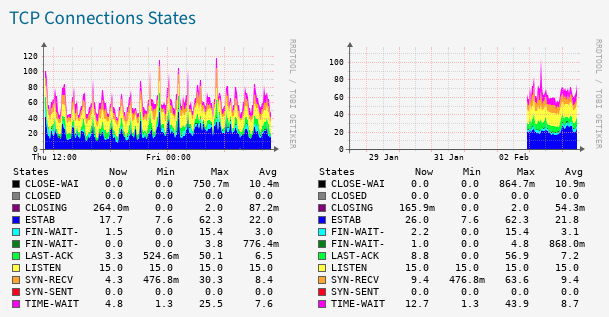

# observium-app-tcpstates
Application (module) for Observium to show TCP Connections States



## About
The powerfull monitoring tool [Observium](https://www.observium.org/) allows us to create new modules called [Applications](https://docs.observium.org/apps/). Applications are modules designed to collect and display data collected from Linux hosts via the [agent](https://docs.observium.org/unix_agent/). These module use linux command ```ss``` to collect TCP Connections States, and with the ✨magic✨ of Observium the data is processed, stored and displayed.

## Usage

1. On your Observium server copy all the PHP files to the corresponding place, ex. copy the file «[includes/definitions/rrdtypes.inc.php](includes/definitions/rrdtypes.inc.php)» to your ```/{OBSERVIUM_INSTALL_DIRECTORY}/includes/definitions/```. For more information of how to add application check [this page](https://docs.observium.org/developing/add_app/).
2. On the server that you want to monitoring copy the unix agent «[observium_agent/scripts-enabled/tcpstates](observium_agent/scripts-enabled/tcpstates)» to ```/usr/lib/observium_agent/scripts-enabled/``` or ```/usr/lib/observium_agent/local/``` depend on your configuration.

## Enjoy!
